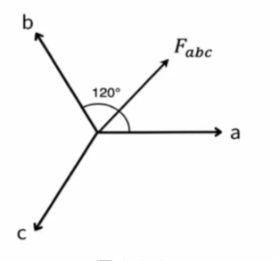
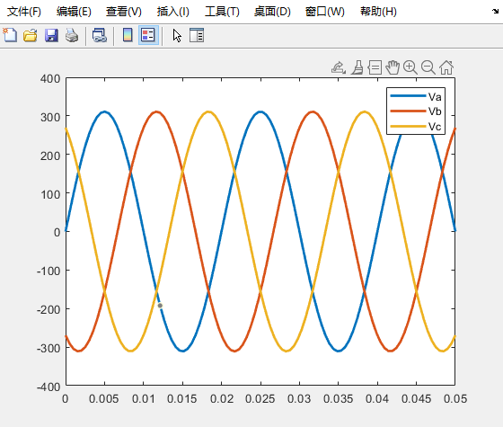
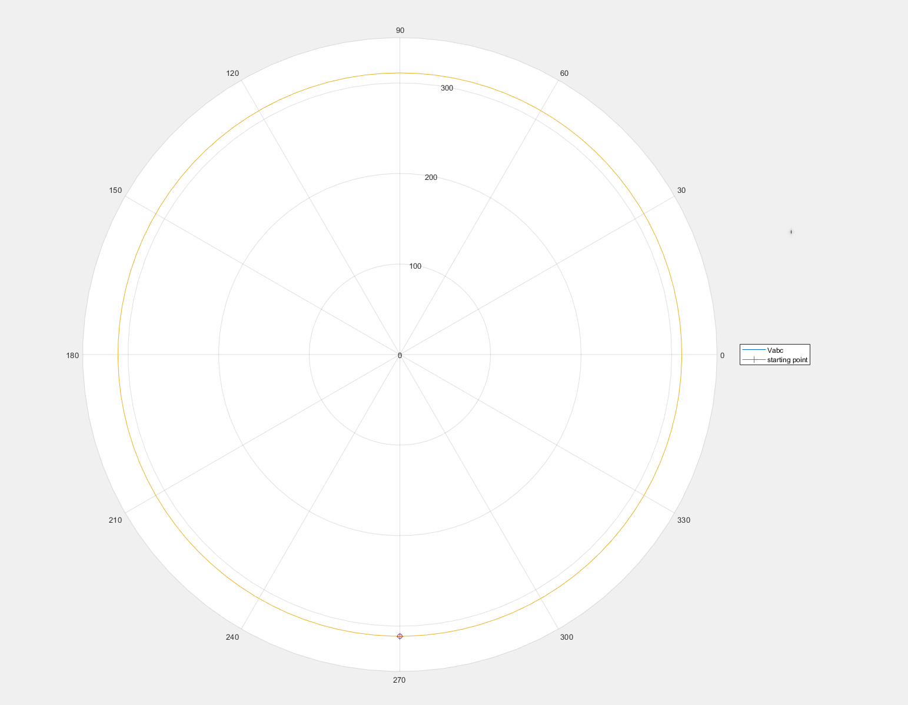
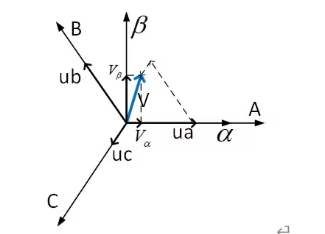
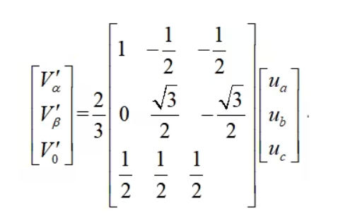
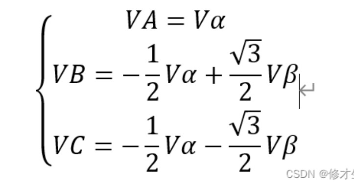
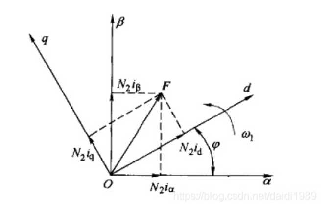
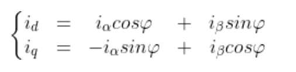
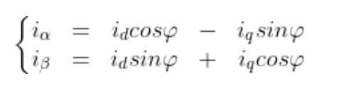
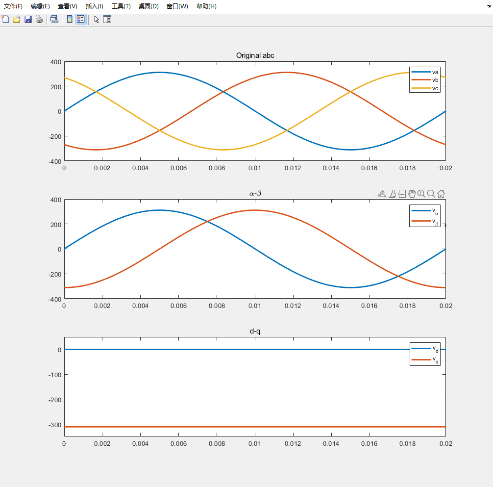

# 空间矢量、Clarke变换与Park变换

## 1.空间矢量

电机控制中，若使用三相系统中所推导的电机模型，很难发展出转矩与磁场解耦的控制法则；使用空间矢量这一手段较容易获得此效果。

使用空间向量的前提条件是物理量需满足三相平衡条件：
$$
f_{a}(t)+f_{b}(t)+f_{c}(t)=0
$$
若满足该条件，则空间矢量定义如下：
$$
F_{abc}=\frac{2}{3}[f_{a}(t)+af_{b}(t)+a^{2}f_{c}(t)]
$$
其中：
$$
a = e^{j\frac{2\pi}{3}}
$$
图像如下所示（若逆时针顺序为a->b->c为正相序，反之为负相序）：



实际中是先有的物理现象后有的该公式；其中公式中的2/3系数主要是为了保证相乘后的方程峰值为单自由度峰值（幅值不变原则）。

使用matalb绘制电机三相电压：

```matlab
t = linspace(0, 0.05, 100);
va = 220*1.414*sin(2*pi*50*t);
vb = 220*1.414*sin(2*pi*50*t-2*pi/3);
vc = 220*1.414*sin(2*pi*50*t-4*pi/3);
plot(t, va, t, vb, t, vc, 'LineWidth', 2);
legend('Va','Vb','Vc')
```



将Va、Vb、Vc带入到空间矢量公式中，使用matlab绘制图形：

```matlab
t = linspace(0, 0.02, 100);
va = 220*1.414*sin(2*pi*50*t);
vb = 220*1.414*sin(2*pi*50*t+2*pi/3);
vc = 220*1.414*sin(2*pi*50*t-2*pi/3);
vabc = 2/3*(va + exp(1j*2*pi/3)*vb + exp(1j*4*pi/3)*vc);
polarplot(vabc);
hold on
t1 = 0.5*(1/50);
va1 = 220*1.414*sin(2*pi*50*t1);
vb1 = 220*1.414*sin(2*pi*50*t1+2*pi/3);
vc1 = 220*1.414*sin(2*pi*50*t1-2*pi/3);
vabc1 = 2/3*(va1 + exp(1j*2*pi/3)*vb1 + exp(1j*4*pi/3)*vc1);
polarplot(vabc1,'-o');
legend('Vabc','starting point','LineWidth',2)
```

可绘制如下图所示图像，其中，起始点为-90°，Vabc为黄色线，幅值约为311，方向为逆时针。



matlab中使用了polar函数，基本用法为：

```matlab
polarplot(theta, rho)
% theta:极角，通常以弧度表示；rho：极径；
```

示例：

```matlab
theta = 2*pi*rand(1,100); % 随机生成极角数组
rho = rand(1,100); % 随机生成对应的极径数组
polarplot(theta, rho, 'o'); % 绘制散点图
```

## 2.Clarke变换

所有的坐标变换都可以认为是在不同的坐标轴投影。

分别在a自由度作为α轴，垂直90°作为β轴。



已知空间矢量定义如下：
$$
F_{abc}=\frac{2}{3}[f_{a}(t)+af_{b}(t)+a^{2}f_{c}(t)]
$$
分别做α轴、β轴投影：
$$
f_{α}=Re[\frac{2}{3}[f_{a}(t)+af_{b}(t)+a^{2}f_{c}(t)]
$$

$$
f_{β}=Im[\frac{2}{3}[f_{a}(t)+af_{b}(t)+a^{2}f_{c}(t)]
$$

根据几何关系，化简得：



除非三相不平衡，否则V0保持为0；根据矩阵运算，可得Clarke反变换为;转化为3x3矩阵主要是可推导反Clarke转换。

Clarke反变换如下所示：



使用matlab实现Clarke变换与反变换：

```matlab
t = linspace(0, 0.02, 100);

% 初始波形
va = 220*1.414*sin(2*pi*50*t);
vb = 220*1.414*sin(2*pi*50*t-2*pi/3);
vc = 220*1.414*sin(2*pi*50*t-4*pi/3);

% Clarke变换
v_alpha = 2/3*(1*va - 0.5*vb - 0.5*vc);
v_beta = 2/3*(sqrt(3)/2*vb - sqrt(3)/2*vc);
v_zero = 2/3*(0.5*va + 0.5*vb + 0.5*vc);

% Clarke反变换
va1 = v_alpha + v_zero;
vb1 = -0.5*v_alpha + sqrt(3)/2*v_beta + v_zero;
vc1 = -0.5*v_alpha - sqrt(3)/2*v_beta + v_zero;

subplot(3,1,1);
plot(t, va, t, vb, t, vc, 'LineWidth', 2);
legend('va', 'vb', 'vc');
title('Original abc');
subplot(3,1,2);
plot(t, v_alpha, t, v_beta, 'LineWidth', 2);
legend('v_\alpha', 'v_\beta');
title('\alpha\beta');
subplot(3,1,3);
plot(t, va1, t, vb1, t, vc1, 'LineWidth', 2);
legend('va', 'vb', 'vc');
title('abc-\alpha\beta-abc');
```


观察图像易得：

+  α分量与β分量依然为周期信号，且周期与初始单自由度信号周期相同；
+ 空间矢量从-90°开始，与α分量从0开始（垂直）、β分量从负极限值开始相吻合；

## 3.Park变换

为什么进行Park变换？

+ 经过Clarke变换后还是正弦波，不好处理；

什么是Park变换？

+ 在Clarke变换的基础上，使α轴、β轴沿相同角速度旋转，此时，原有α轴叫d轴，β轴叫q轴。

Park变换图像表示如下：



根据几何关系可推得：



可得反变换为：



通过matlab绘制图像：



如何理解dq轴数据？

+ 矢量起始在-90°开始，开始时，与d轴垂直，所以d轴数据为0，q轴相反，所以q轴为负极限；
+ 开始旋转后，合成矢量与dq轴以相同角速度旋转，所以保持初始数值不变；

## 4.总结

通过矢量合成，可将多自由度的物理量转换为一合成量，便于分析；

对于正弦波信号来说，通过矢量合成后的物理量仍然为正弦波，不易分析，通过clark、park变换后，成功设计一个旋转的坐标系，此时可将正弦物理量转换为两个直流信号，便于后续问题分析。
