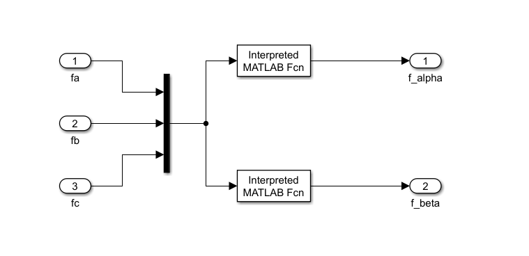

# 三相鼠笼电机simulink建模

## 1 方程

电机方程：
$$
\frac{di_{s\alpha}}{dt}=K_{1}i_{s\alpha}+K_{2}\phi_{r\alpha}+K_{3}\omega_{r}\phi_{r\beta}+K_{4}v_{s\alpha}
$$

$$
\frac{di_{s\beta}}{dt}=K_{1}i_{s\beta}-K_{3}\omega_{r}\phi_{r\alpha}+K_{2}\phi_{r\beta}+K_{4}v_{s\beta}
$$

其中，
$$
K_{1}=\frac{-R_{s}L^{2}_{r}-R_{r}L^{2}_{m}}{L_{r}w},K_{2}=\frac{R_{r}L_{m}}{L_{r}w},K_{3}=\frac{L_{m}}{w},K_{4}=\frac{L_{r}}{w},w=L_{r}L_{s}-L^{2}_{M}
$$
另外，
$$
\frac{d\phi_{r\alpha}}{dt}=K_{5}i_{s\alpha}+K_{6}\phi_{r\alpha}-\omega_{r}\phi_{r\beta}
$$

$$
\frac{d\phi_{r\beta}}{dt}=K_{5}i_{s\beta}+\omega_{r}\phi_{r\alpha}+K_{6}\phi_{r\beta}
$$

其中，
$$
K_{5}=\frac{R_{r}L_{m}}{L_{r}},K_{6}=-\frac{R_{r}}{L_{r}}
$$
转矩方程：
$$
\frac{d\omega_{rm}}{dt}=\frac{1}{J}(T_{e}-T_{L}-b\omega_{rm})
$$

$$
T_e=\frac{3P}{4}\frac{L_m}{L_r}(i_{s\beta}\phi_{r\alpha}-i_{s\alpha}\phi_{r\beta})
$$

其中，
$$
\omega_{rm}=\frac{2}{P}\omega_{r},P为马达极数
$$

## 2 电机参数

| 电机参数     | 数值               |
| :----------- | :----------------- |
| 定子电阻Rs   | 0.8Ω               |
| 转子电阻Rr   | 0.6Ω               |
| 定子电感Ls   | 0.085H             |
| 转子电感Lr   | 0.085H             |
| 互感Lm       | 0.082H             |
| 马达极数pole | 4                  |
| 转动惯量J    | 0.033kg·m3         |
| 摩擦系数B    | 0.00825M·m·sec/rad |

## 3 simulink建模

+ 输入电机参数

首先建立matlab脚本将电机参数输入到matlab环境中，

```matlab
Rs = 0.8;
Rr = 0.6;
Ls = 0.085;
Lr = 0.085;
Lm = 0.082;
pole = 4;
J = 0.033;
B = 0.00825;
w = Ls*Lr - Lm^2;
Lsigma = w/Lr;
K1 = (-Rs*Lr^2-Rr*Lm^2)/(Lr*w);
K2 = (Rr*Lm)/(Lr*w);
K3 = Lm/w;
K4 = Lr/w;
K5 = Rr*Lm/Lr;
K6 = -Rr/Lr;

%sigma = 1 - Lm^2/(Ls*Lr);
```

+ 根据电机方程建立电机模型：


+ 建立Clarke与Clarke反变换模型




+ 建立Park变换与Park反变换模型


+ 连接成系统


## 4 测试模型

+ 验证clarke模块

观察scope波形如下，输入为正相序，即Valpha初始0、Vbeta初始为-314；


+ 验证电机模型

观察w的scope，最终转速稳定在1490rpm，小于目标设定值1500rpm；这是由于感应电机存在滑差，即实际转速小于同步转速。


观察电磁转矩Te，约为9N，大于负载转矩；这是由于一部分电磁转矩要克服摩擦力。


+ 验证Park变换

观察示波器，系统稳定后，dq轴电流都变为直流分量。


+ 验证park反变换与clarke反变换

将电机输出的dq轴电流经过park反变换与clarke反变换，观察是否与输入一致。


