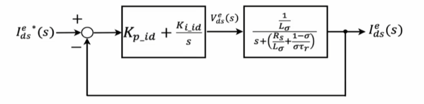
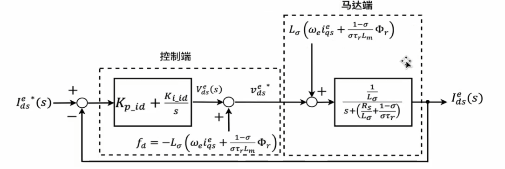
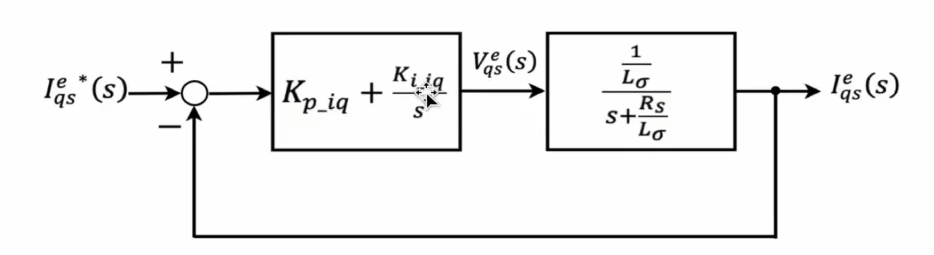
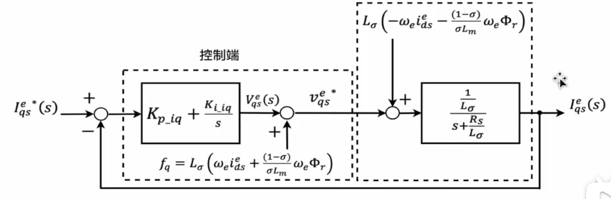
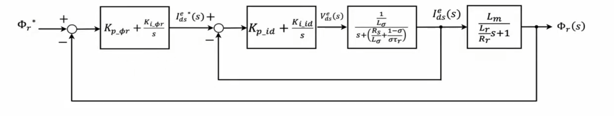
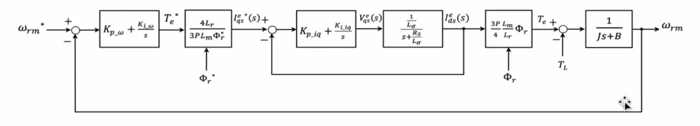
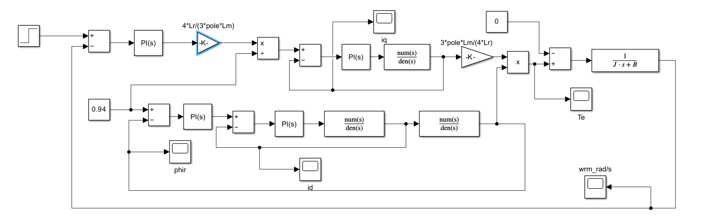
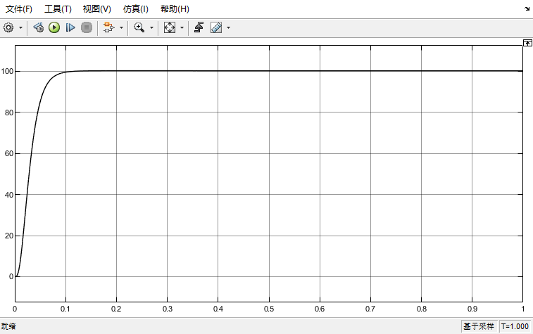
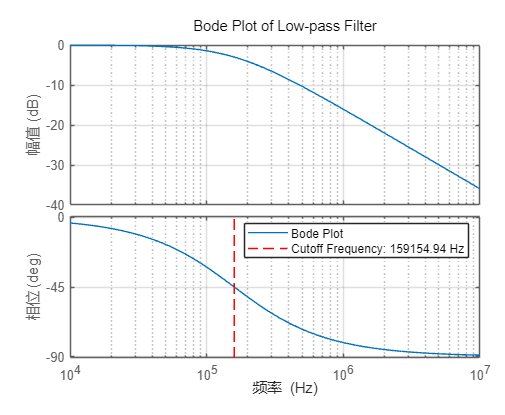

# 三相鼠笼式感应马达磁场导向控制

## 1.控制思路

三相鼠笼电机方程如下(上标e代表二轴同步旋转坐标系)：
$$
\frac{di^e_{ds}}{dt}=(-\frac{R_s}{L_\sigma}-\frac{1-\sigma}{\sigma\tau_r})i^e_{ds}+\omega_ei^e_{qs}+\frac{1-\sigma}{\sigma\tau_rL_m}\Phi_r+\frac{v^e_{ds}}{L_{\sigma}}    \\
\frac{di^e_{qs}}{dt}=-\frac{R_s}{L_{\sigma}}i^e_{qs}-\omega_ei^e_{ds}-\frac{(1-\sigma)}{\sigma L_m}\omega_e\Phi_r+\frac{v^e_{qs}}{L_{\sigma}} \\
\frac{d \Phi_r}{dt}=-\frac{R_r}{L_r}\Phi_r+R_r\frac{L_m}{L_r}i^e_{ds} \\
-R_r\frac{L_m}{L_r}i^e_{qs}+\omega_{sl}\Phi_r = 0
$$
其中：
$$
\sigma = 1-\frac{L^2_m}{L_sL_r} \\
L_{\sigma}=\sigma L_s \\
\tau_r = \frac{L_r}{R_r} \\
\omega_{sl} = \omega_e-\omega_r
$$
转矩方程为：
$$
T_e=\frac{3P}{4}\frac{L_m}{L_r}(i^e_qs\Phi^e_{dr}-i^e_{ds}\Phi^e_{qr}) = \frac{3P}{4}\frac{L_m}{L_r}(i^e_{qs}\Phi_r)
$$
由电机方程可知，转子磁通链只与定子d轴电流有关；由转矩方程可知，马达转矩正比于转子磁通链和定子q轴电流乘积。

若转子磁通链被稳定控制，则转矩只与定子q轴电流有关，从而实现磁通与转矩的解耦控制。

想要控制转子磁通链，需要两个控制回路：①转子磁通链控制回路；②定子d轴电流控制回路。

当转子磁通链被稳定控制，可以通过转速回路产生转矩命令，进而控制定子q轴电流，则需要两个控制回路：①马达转速控制回路；②定子q轴电流控制回路；

设计原则：①由内而外；②内回路带宽高于外回路5~10倍。

## 2.电流回路设计

由于定子电流和转子磁场之间的相互作用，会产生非线性耦合项，如定子电流与转速的乘积。为了解决这个问题，在控制回路中添加补偿项来实现解耦。

dq轴电流方程如下：
$$
\frac{di^e_{ds}}{dt}=(-\frac{R_s}{L_\sigma}-\frac{1-\sigma}{\sigma\tau_r})i^e_{ds}+\omega_ei^e_{qs}+\frac{1-\sigma}{\sigma\tau_rL_m}\Phi_r+\frac{v^e_{ds}}{L_{\sigma}}    \\
\frac{di^e_{qs}}{dt}=-\frac{R_s}{L_{\sigma}}i^e_{qs}-\omega_ei^e_{ds}-\frac{(1-\sigma)}{\sigma L_m}\omega_e\Phi_r+\frac{v^e_{qs}}{L_{\sigma}} \\
$$

### 2.1 d轴电流控制回路

+ PI控制器设计

假设非线性项已经被完全补偿，则d轴电流方程为：
$$
\frac{di^e_{ds}}{dt}=(-\frac{R_s}{L_\sigma}-\frac{1-\sigma}{\sigma\tau_r})i^e_{ds}+\frac{v^e_{ds}}{L_{\sigma}}    \\
$$
进行拉式变换，可得：
$$
I^e_{ds}(s)=V^e_{ds}(s)×\frac{\frac{1}{L_\sigma}}{s+(\frac{R_s}{L_{\sigma}+\frac{1-\sigma}{\sigma\tau_r}})}
$$
可设计PI控制回路为：



代数换算，令：
$$
N = \frac{1}{L_{\sigma}} \\
D =\frac{R_s}{L_\sigma}+\frac{1-\sigma}{\sigma\tau_r} \\
$$
则受控场变为：
$$
\frac{\frac{1}{L_\sigma}}{s+(\frac{R_s}{L_{\sigma}+\frac{1-\sigma}{\sigma\tau_r}})} = \frac{N}{S+D}
$$
整理PI控制器形式：
$$
K_{p\_id}+\frac{K_{i\_id}}{s}=K_{p\_id}(\frac{s+\frac{K_{i\_id}}{K_{p\_id}}}{s})
$$
假设wd为满足控制回路所需的带宽，利用零极点对消方法，可设计PI增益为：
$$
K_{p\_id} = \frac{\omega_{d}}{N} \\
K_{i\_id} = \frac{D\omega_d}{N}  \\
$$
可得开环传递函数为：
$$
G_{d\_open} = \frac{\omega_d}{s}
$$
可得闭环传递函数如下，形式为介质频率为wd的一阶低通滤波器：
$$
G_{d\_close} = \frac{\omega_d}{s+\omega_d}
$$

+ 非线性项补偿

以上控制器设计是基于非线性项完全补偿所设计，现在考虑如何补偿非线性项。

完整电机方程为：
$$
\frac{di^e_{ds}}{dt}=(-\frac{R_s}{L_\sigma}-\frac{1-\sigma}{\sigma\tau_r})i^e_{ds}+\omega_ei^e_{qs}+\frac{1-\sigma}{\sigma\tau_rL_m}\Phi_r+\frac{v^e_{ds}}{L_{\sigma}}    \\
$$
PI控制器的输出为电压指令，在电压指令进入点击前，添加一个前馈补偿：
$$
f_d=-L_{\sigma}(\omega_ei^e_{qs}+\frac{1-\sigma}{\sigma\tau_rL_m}\Phi_r)
$$
则实际进入马达的电压为：
$$
v^{e*}_{ds} = v^{e}_{ds} + f_d
$$
代入电机方程，解得：
$$
\frac{di^e_{ds}}{dt}=(-\frac{R_s}{L_\sigma}-\frac{1-\sigma}{\sigma\tau_r})i^e_{ds}+\frac{v^e_{ds}}{L_{\sigma}}    \\
$$
与之前假设的完全补偿非线性项方程一致，所以d轴完整控制回路设计为;



### 2.2 q轴电流控制回路

+ PI控制回路设计

完整q轴电流方程：
$$
\frac{di^e_{qs}}{dt}=-\frac{R_s}{L_{\sigma}}i^e_{qs}-\omega_ei^e_{ds}-\frac{(1-\sigma)}{\sigma L_m}\omega_e\Phi_r+\frac{v^e_{qs}}{L_{\sigma}} \\
$$
假设非线性项被完全补偿：
$$
\frac{di^e_{qs}}{dt}=-\frac{R_s}{L_{\sigma}}i^e_{qs}+\frac{v^e_{qs}}{L_{\sigma}} \\
$$
拉氏变换可得：
$$
I^e_{qs}(s)=V^e_{qs}(s)×\frac{\frac{1}{L_{\sigma}}}{s+\frac{R_s}{L_{\sigma}}}
$$
设计PI控制回路：



设q轴带宽为wq，与d轴设计方法完全相同，可得闭环传递函数为：
$$
G_{q\_close} = \frac{\omega_d}{s+\omega_d}
$$

+ 非线性项补偿

在电流控制回路后添加前馈补偿：
$$
f_q=L_{\sigma}(\omega_ei^e_{ds}+\frac{1-\sigma}{\sigma L_m}\omega_e\Phi_r)
$$
完整设计回路为：



### 2.3 磁通控制回路

 磁通方程为：
$$
\frac{d \Phi_r}{dt}=-\frac{R_r}{L_r}\Phi_r+R_r\frac{L_m}{L_r}i^e_{ds} \\
$$
拉式变换可得：
$$
\Phi_r(s)=i^e_{ds}(s)×\frac{L_m}{\frac{L_r}{R_r}s+1}
$$
可知，转子磁通只与定子d轴电流有关。想要稳定的控制磁通，还需要一个d轴电流控制回路，磁通控制回路如下所示：



假设内回路电流回路带宽是外回路的五倍以上，则可以将内回路的转移函数为1（可参考chapter4内容）。

假设磁通控制回路带宽为w\phi，利用零极点对消法，可得转子磁通控制回路为：
$$
G_{\phi r\_close} = \frac{\omega_{\phi}}{s+\omega_{\phi}}
$$

### 2.4 速度控制回路

电机转矩方程为：
$$
T_e=\frac{3P}{4}\frac{L_m}{L_r}(i^e_{qs}\Phi_r)
$$
电机机械方程为：
$$
T_e-T_L=J\frac{d\omega_{rm}}{dt}+B\omega_{rm}
$$
拉式变换，可得：
$$
\omega_{rm}=(T_e-T_L)×\frac{1}{Js+B}
$$
完整控制回路如下：



假设q轴电流回路满足带宽要求，则传递函数可变为1，磁通链两项乘积为1，则受控场为电机机械方程。使用零极点对消方法，可得速度控制回路传递函数为：
$$
G_{\omega\_close} = \frac{\omega_s}{s+ \omega_s}
$$

## 3.simulink验证

建立simulink模型：



转速示波器：



## 4.内回路与外回路带宽关系

当电流内回路带宽为外回路带宽的五倍以上时，可以假设电流回路的传递的函数为1。原因是此时电流控制回路可以看做一个低通滤波器，观察低通滤波器的波特图。

低通滤波器matlab脚本：

```matlab
% 低通滤波器设计
R = 1; % 电阻值
C = 1e-6; % 电容值

% 传递函数
num = 1/(R*C);
den = [1 1/(R*C)];

sys = tf(num, den); % 创建传递函数模型

% 绘制 Bode 图
figure;
h = bodeplot(sys); % 获取 bode 图句柄
setoptions(h, 'FreqUnits', 'Hz'); % 设置频率单位为 Hz
title('Bode Plot of Low-pass Filter');
grid on;

% 手动标出截止频率
fc = 1/(2*pi*R*C); % 截止频率
hold on;
plot([fc fc], ylim, 'r--'); % 画一条红色虚线表示截止频率
legend('Bode Plot', sprintf('Cutoff Frequency: %.2f Hz', fc));
hold off;
```

Bode图为：



在图中可以看出，在电流环截止频率的1/5或1/10处，幅值与相位基本为0，即可看做传递函数为1。