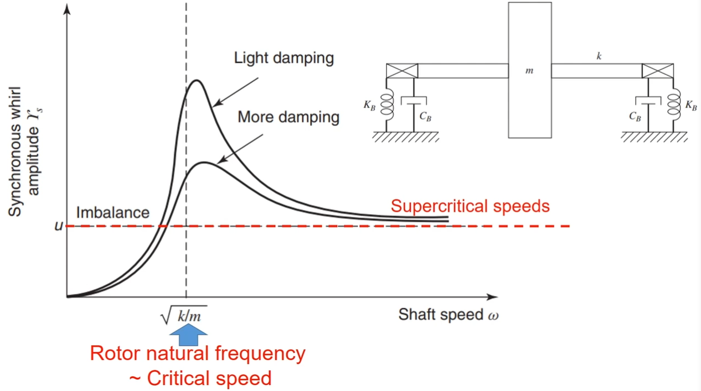
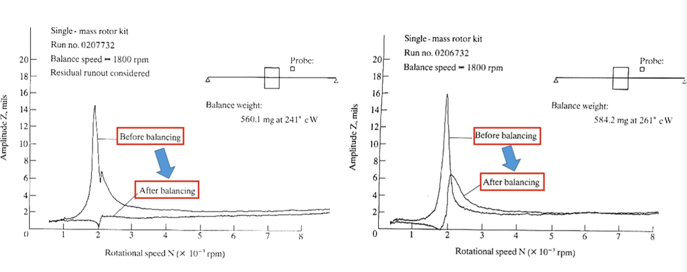
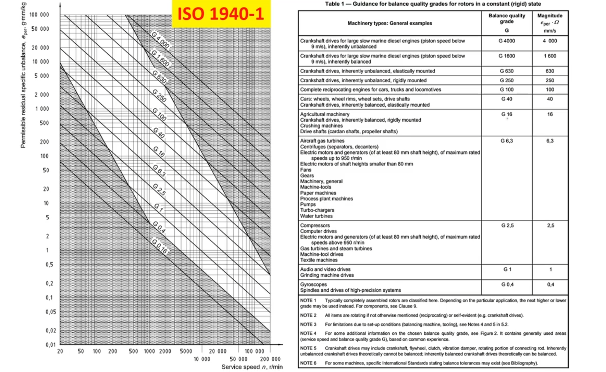

# [转子动力学]-临界转速和对不平衡量的响应

+ 什么是临界转速？

对不平衡量响应达到最大值的速度。

转子不平衡量是由于转子几何中心与质心之间的偏移所造成的；当转子旋转时，转频就成了激励频率，所以当转子转速与转子的固有频率一致时，转子的振动达到最大值，这个转速被称为临界转速。

> 1. **临界转速（Critical Speed）：**
>     - 临界转速指的是系统在某个特定转速下，由于其固有的振动模态导致系统发生共振，即系统振动幅值变得非常大。在这个转速下，系统的某些振动模态的固有频率与机械系统的转动频率发生共振，从而引起严重的振动问题。
>     - 在临界转速处，系统的动力学特性需要特别关注，以避免共振造成的损坏或性能下降。
> 2. **超临界转速（Supercritical Speed）：**
>     - 超临界转速是指系统转速高于临界转速的情况。在超临界转速范围内，系统的振动不再由共振所主导，而是由系统结构和支撑条件等因素决定。
>     - 超临界转速下，通常设计会更稳定，因为可以避免临界转速共振带来的不利影响。设计师通常会努力确保机械系统的运行转速远高于其临界转速，以保证系统的稳定性和性能。

+ 如何获得转子的临界转速？

1. 使用软件进行建模，像Ansys。
2. 通过冲击测试。

+ 转速与振幅之间的关系

在临界转速之前，振幅随转速的上升而上升；超过临界转速进入超临界转速后，系统的振动不再有共振主导，而是由系统决定。

+ 如何减小旋转时的振幅？

1. 平衡转子；

以下为调整转子动平衡对转子振幅的影响。

2.使运行速度原理临界转速；

3.对转子-轴承系统增加更大的阻尼；

+ 转子动平衡ISO标准

以下为转子动平衡的ISO标准：

> 转子平衡质量等级（G等级）是指ISO 1940-1标准中用于衡量转子动平衡质量的一个重要指标。这些等级通常用于确定在给定的转子转速范围内所允许的最大不平衡量。G等级是根据转子的类型（例如刚性转子或柔性转子）和转速来确定的。
> 根据ISO 1940-1标准，转子平衡质量等级通常表示为Gx.y，其中：
>
> 1.x 表示转子的类型，通常有两种类型：
> 2.G1.0：刚性转子，如风扇、轴承或较短的轴；
> 3.G2.5：柔性转子，如较长的轴或涡轮机。
> 4.y 表示允许的不平衡质量的单位，通常有三个级别：
> 5.G1.0、G2.5和G6.3分别对应于单位是1g、2.5g和6.3g·mm/kg。
>
> 这里的"g"是重力加速度，而“mm”是毫米。