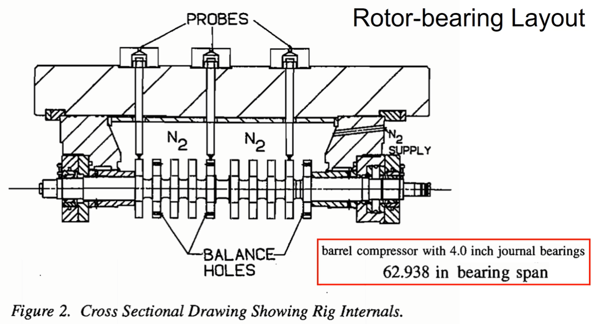
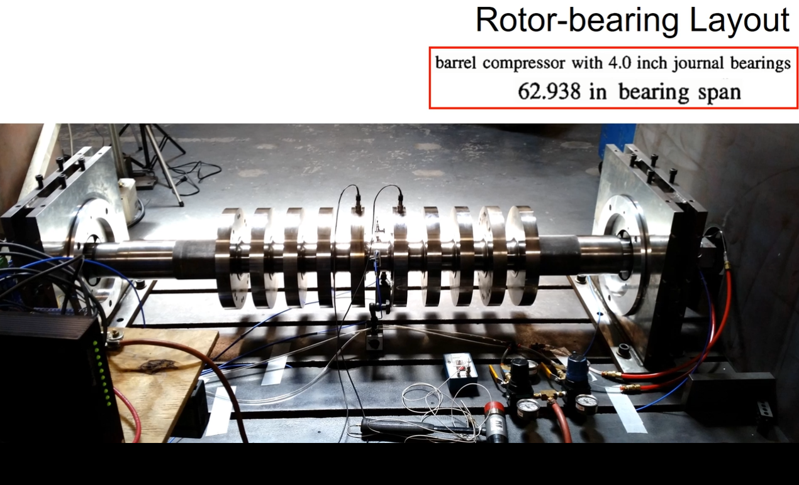
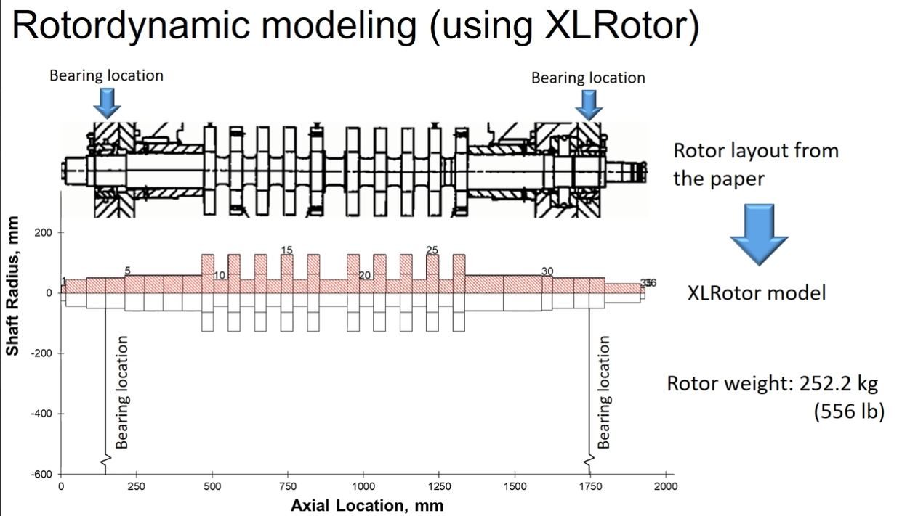
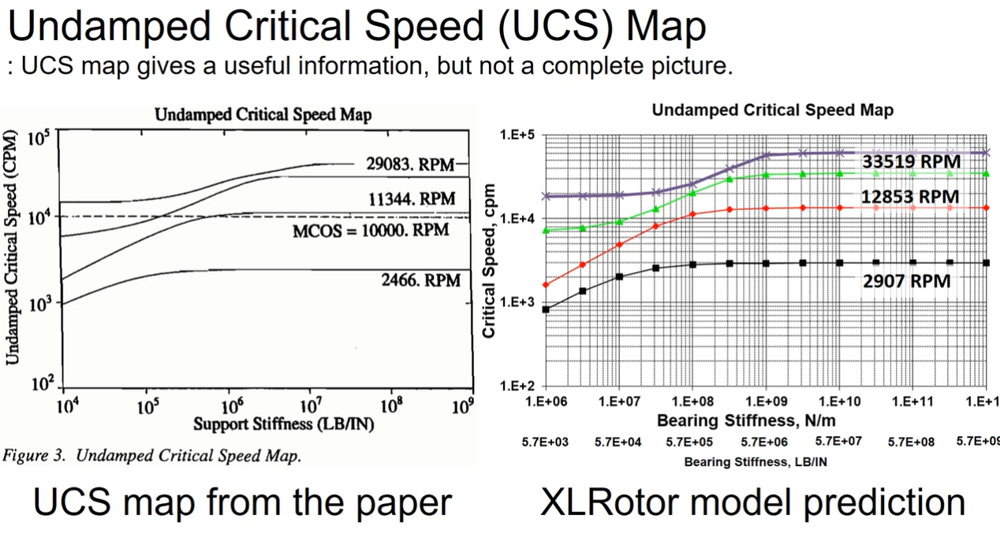
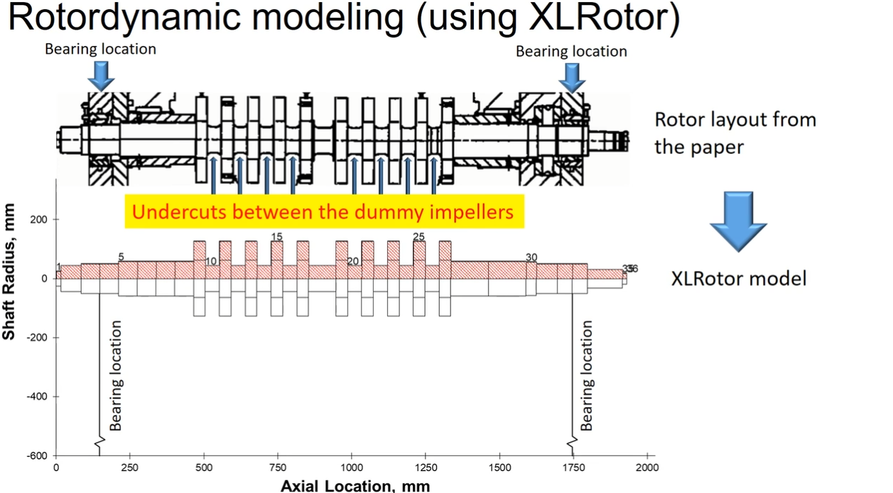
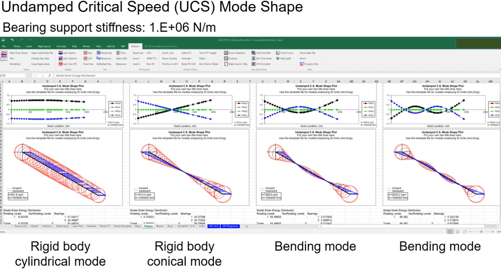
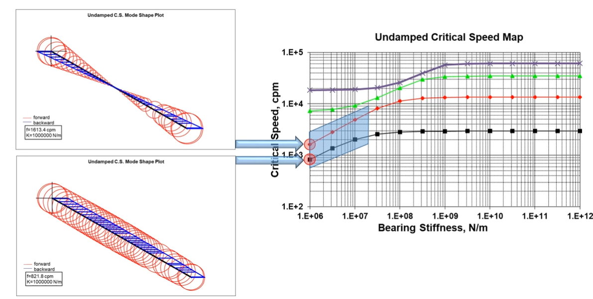
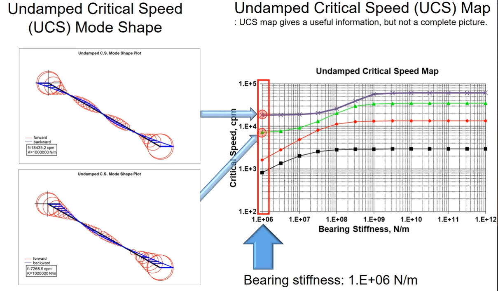
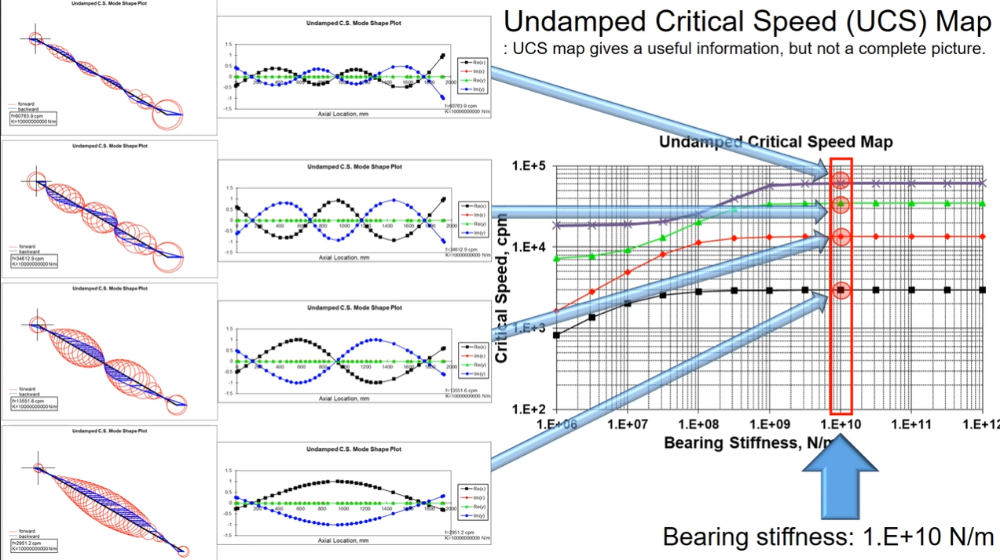
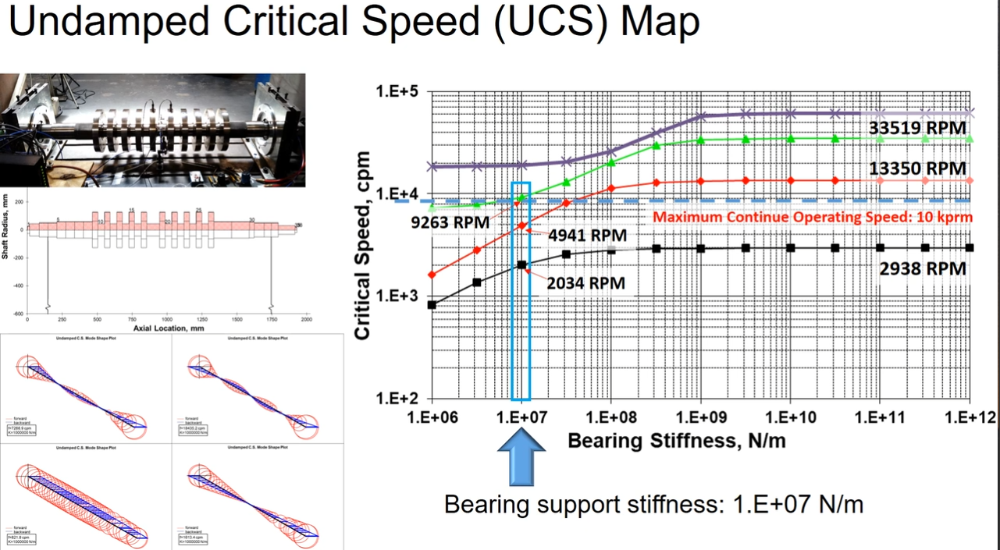

# [转子动力学]-无阻尼临界转速

以论文《SQUEEZE FILM DAMPER BEARING EXPERIMENTAL VS ANALYTICAL RESULTS FOR VARIOUS DAMPER CONFIGURATIONS》数据与为参考，对比软件仿真结果并进行分析。

> 无阻尼临界转速（undamped critical speed）指的是在没有考虑阻尼的情况下，转子系统发生共振的临界转速。具体来说，这是指在忽略系统的阻尼影响下，由于系统的惯性和弹性特性导致的自由振动频率与转子的转速达成共振，从而引起系统振幅无限增长的转速点。

## 1.转子临界转速仿真

研究对象为一个桶式压缩机，其结构示意图如下所示：

实物图如下所示：

将转子结构数据输入到XLRotor中进行仿真：

对比论文中无阻尼临界转速与模型仿真结果，趋势基本类似，但仿真结果与实际还是有一定差距。

> + MCOS
>
> 在转子动力学领域，MCOS通常指的是"Multi Critical Operating Speeds"，即多个临界运行速度。这个术语通常用于描述一个转子系统可能存在多个临界转速的情况。
>
> 在实际的旋转机械系统中，尤其是复杂的工业设备或高速旋转机械中，可能会出现多个不同的临界运行速度。每个临界速度对应于系统特定的振动模态，当系统运行到这些临界速度时，会导致不同的振动特性和可能的共振问题。
>
> + 支撑刚度
>
> 支撑刚度（bearing stiffness）指的是轴承或支撑系统提供的力与位移之间的关系。具体来说，支撑刚度描述了当转子在轴承或支撑系统中运转时，系统对于转子位移的反弹能力或者变形率。
>
> 支撑刚度可以被理解为一个系统在给定载荷下的弹性反应。它可以用于计算转子的共振频率、稳定性以及振动特性。通常情况下，支撑刚度越高，轴承或支撑系统对转子的约束力就越强，从而导致转子的共振频率提高，并且减少系统的振动。
>
> 对于简单支撑（如简支轴承），支撑刚度可以表示为：
> $$
> [
> K = \frac{3EI}{L^3}
> ]
> $$
> 其中，
>
> ( E ) 是轴承或支撑系统的弹性模量（Young's modulus）；
>
> ( I ) 是截面惯性矩（即横截面的转动惯量）；
>
> ( L ) 是支撑系统的长度或间距。
>
> + 磁轴承的支撑刚度
>
> 磁轴承支撑刚度的计算通常需要考虑电磁力的大小及其对转子位移的反应。
> $$
> K = \frac{F}{\delta}
> $$
> 

仿真与实际不符的可能原因，忽略了叶轮之间的其它装配关系：

## 2.仿真数据分析

接下来分析两种不同支撑刚度下的转子临界转速。

### 2.1 低支撑刚度

进一步对比相同支撑刚度（1.E+06）下的转子模态：分别是刚体圆柱模态、刚体圆锥模态以及两个弯曲模态。

这四个不同振型与仿真出的模态图是对应关系:

> 刚体振动模态在有效的阻尼效果下会被抑制掉。

### 2.2 高支撑刚度

在高支撑高度下，转子模态都是弯曲模态。

### 2.3 应用分析

假设有一个设备工作在1.E+07的支撑刚度、10000rpm的工作转速下，参考下方临界转速图，易得：

+ 升速过程中，会经历三个临界转速；
+ 如果工作转速靠近第三个临界转速，是不建议长期运行在该临界转速下的；

## 3.总结

对于实际工业应用来说，不建议设备长期运行在共振频率下，因为此时振幅最大，长期运行有可能损坏设备。如果系统中的阻尼足够大，会使转子在临界转速下运行比较稳定。