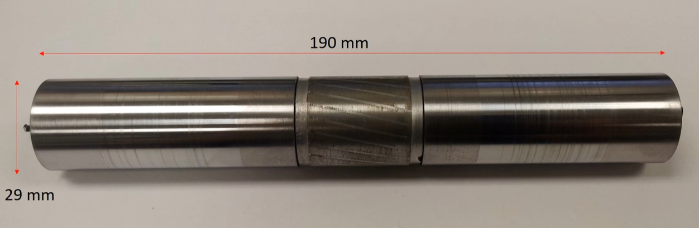
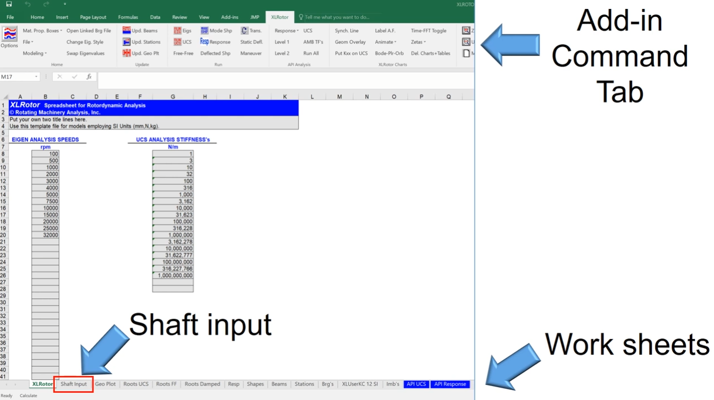
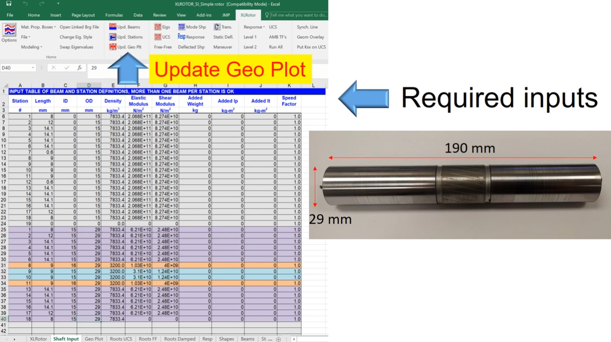
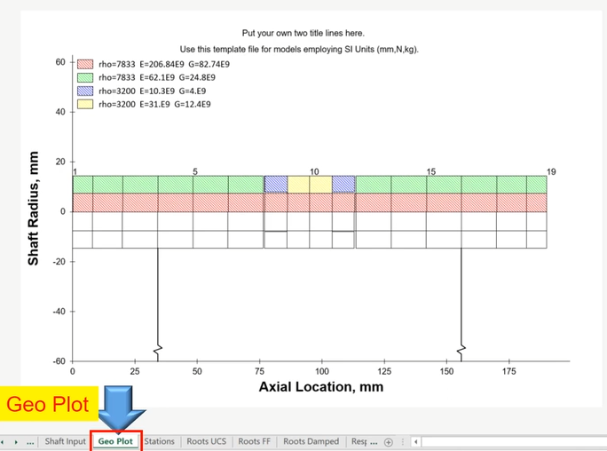
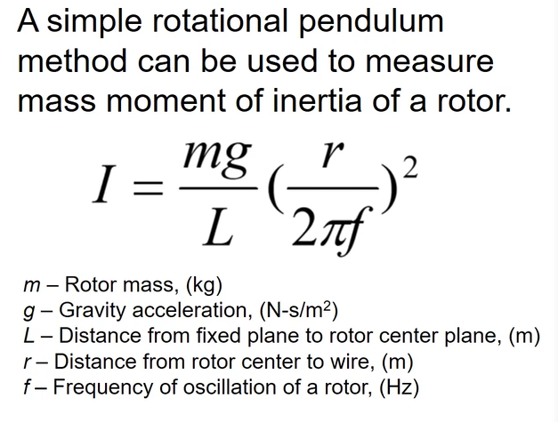
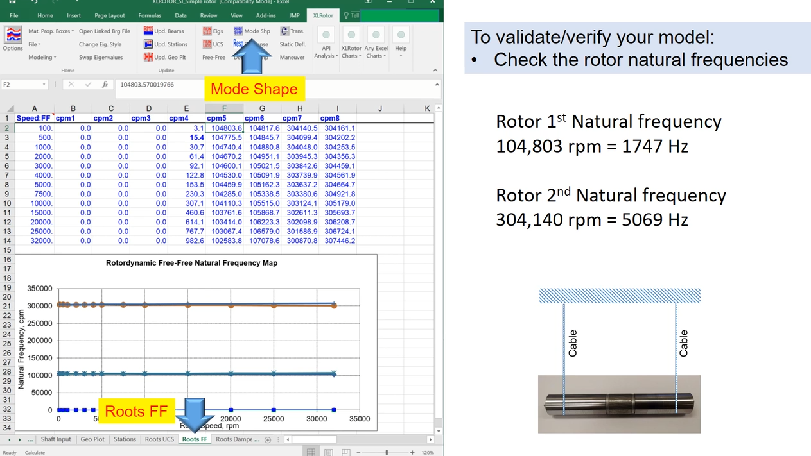
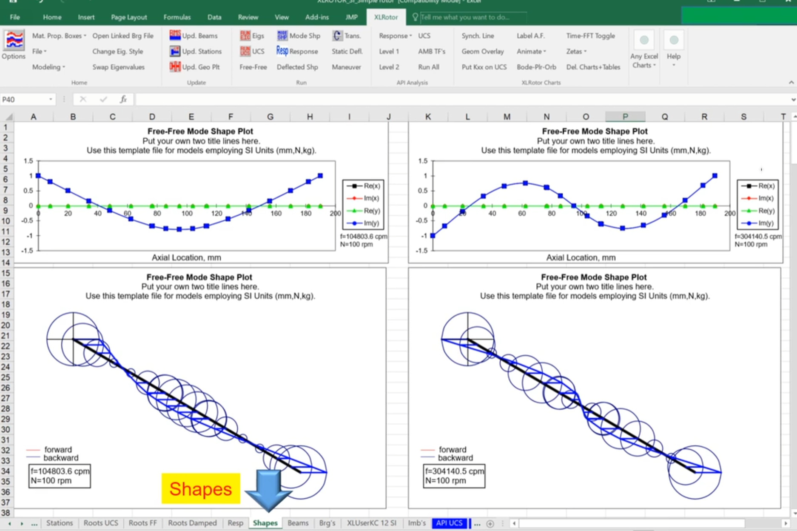
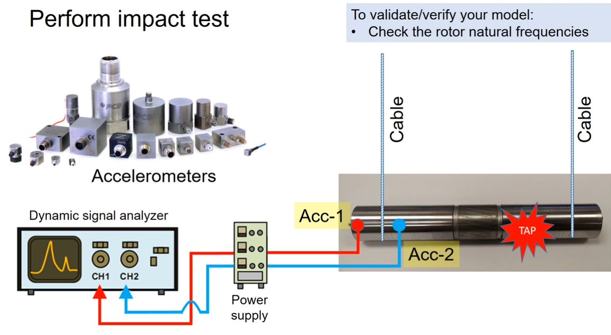
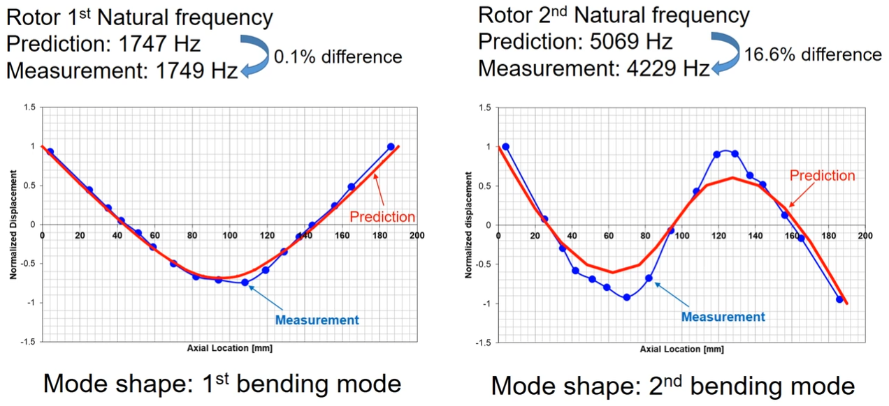

# [转子动力学]-转子动力学有限元仿真与冲击试验

## 1.转子有限元仿真—以XLRotor为例

1.创建转子几何尺寸

直径29mm，长度190mm。

2.软件界面

3.输入几何参数与材料数据，并获得输出；

4.软件仿真结果

5.对于软件仿真结果，可以通过以下方式进行验证：

+ 检查转子的几何尺寸；
+ 检查转子的重量；
+ 检查转子的极惯性矩；

> 以下是计算转子惯性矩的一种简便公式;
>
> 

+ 检查转子固有频率

+ 检查转子振动模态

## 2.冲击试验

试验所需设备包括轴径向加速度传感器、动态信号分析器、电源、转子及其悬挂线缆；连接完成后敲击转子。

以下为振动试验测量结果：

