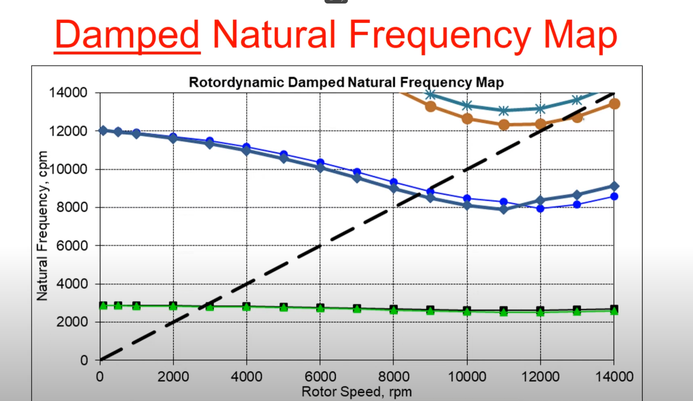
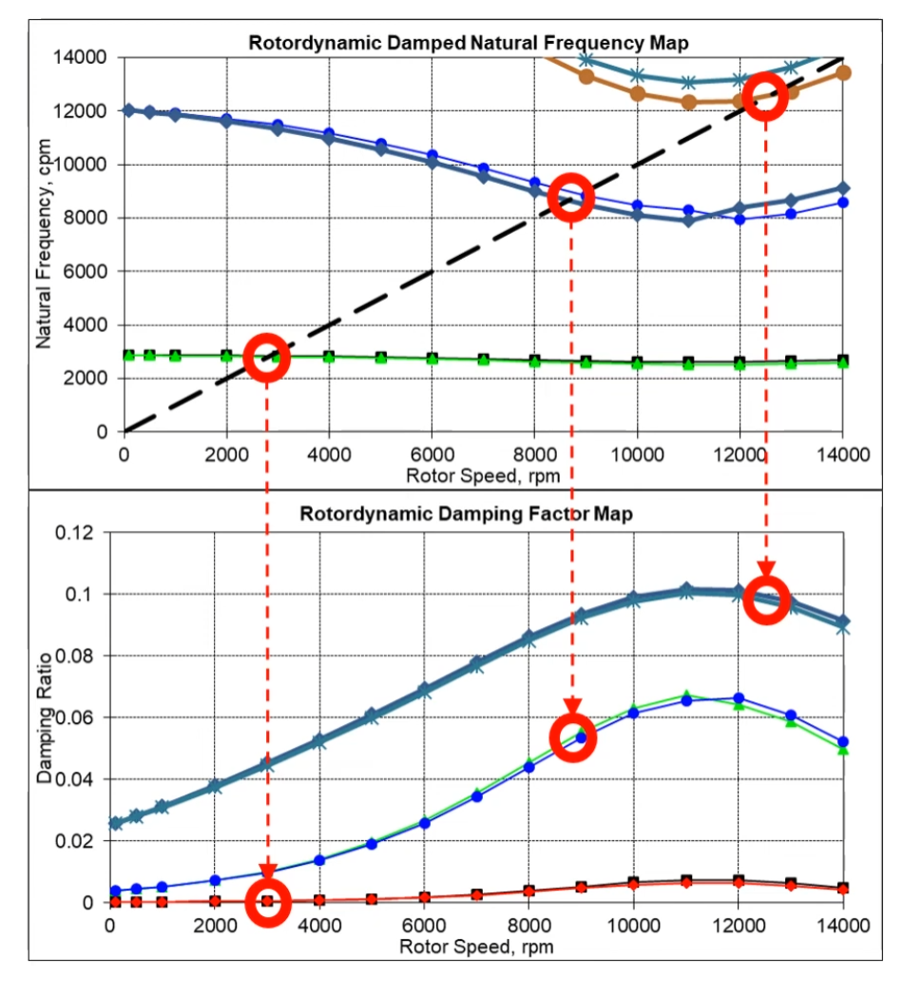

# [转子动力学]-阻尼固有频率

以下为阻尼固有频率图：

在图中可以看出，转子的不同模态的固有频率是随着转子的激励频率变化而发生改变的，这是因为固有频率是与支撑刚度相关的，而转速的变化又会导致支撑刚度的变化。

> 注：
>
> 1. 工业中绝大部分转子动力学分析是关于线性和稳态下的分析。
> 2. 计算和绘制阻尼固有频率图是转子动力学中最常见的工作。

阻尼固有频率与支撑刚度、阻尼和虚拟质量相关，一般来说，轴承厂家会提供这些参数，以便在仿真中输入这些数据。

> 注：
>
> 转子的旋转会引起流体效应，例如为系统贡献质量。例如，液体密封会导致显着的直接刚度和附加质量（虚拟质量）系数，从而导致泵的固有频率（临界速度）发生显着变化。

下图为阻尼固有频率实际案例，在升速过程中，会依次经过图片中红圈中的临界转速。

而实际的临界转速又与阻尼比相关，此时就需要查看阻尼比与临界转速的对照表。

一般来说，越高的转速就需要更高的阻尼比，猜测是由于高速下轴承支撑刚度降低，所以就更需要一个高阻尼来控制。

对于磁轴承来说，磁轴承的阻尼比（damping ratio）是描述系统振动衰减能力的重要参数，它直接影响系统的动态响应和稳定性。磁轴承的阻尼比主要受以下几个因素影响：

1. 控制电流和电磁力： 磁轴承系统通过控制电流来调节电磁力，以支撑和稳定转子。阻尼比直接受控制电磁力的大小和控制方式影响。一般来说，较大的电磁力会导致更高的阻尼比，因为它们能够更有效地耗散系统中的振动能量。
2. 磁悬浮控制系统设计： 磁轴承系统的控制算法和设计对阻尼比也有重要影响。优化的控制策略可以使系统在不同工作条件下维持合适的阻尼比，以确保转子稳定运行并抑制振动。
3. 转子和传感器的动态响应： 转子的质量、几何形状以及支撑结构会影响振动的频率和模态，从而影响阻尼比的需求和控制。传感器的响应特性也会影响系统中实时反馈的精确性，进而影响控制电磁力的精准调节。
4. 环境条件和工作状态： 环境温度、气压等条件变化可能会影响磁轴承的性能和控制效果，间接影响阻尼比的稳定性。
5. 外部扰动和非线性效应： 外部扰动和系统本身的非线性响应（如磁饱和效应）也可能影响磁轴承的阻尼特性，使其在不同工作条件下表现出不同的阻尼比。

总体来说，磁轴承的阻尼比是一个综合了电磁力控制、系统设计和环境影响的动态特性参数。优化和调整这些因素可以改善磁轴承系统的振动控制能力和稳定性，确保转子在高速运转时的安全和效率。